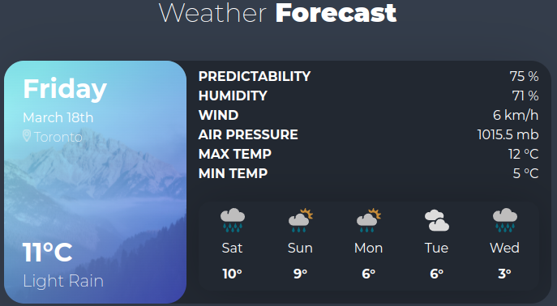

# Weather-React

---

## Description

<p>Project showcasing React and Axios calls to an MetaWeather API</p>

## Preview



### Tech stack

```
Core:
- CSS Modules
- React.js
- Hooks

Communication tool:
- axios
```

## Instructions

```
npm start

Runs the app in the development mode.
Open http://localhost:3000 to view it in your browser.

The page will reload when you make changes.
You may also see any lint errors in the console.
```
